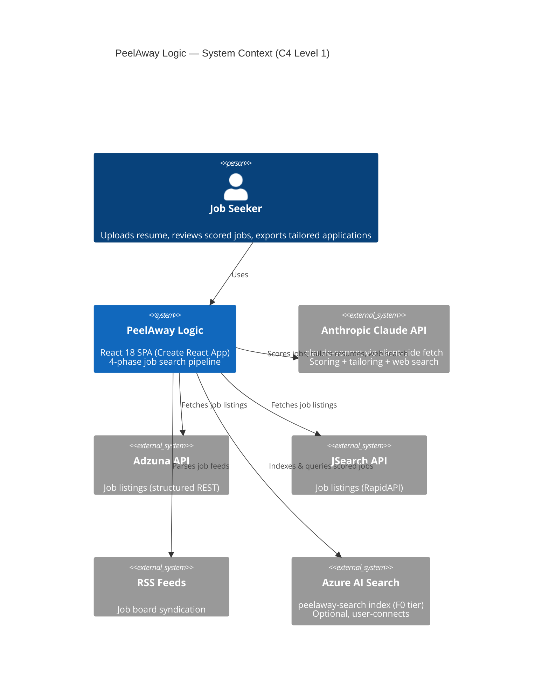
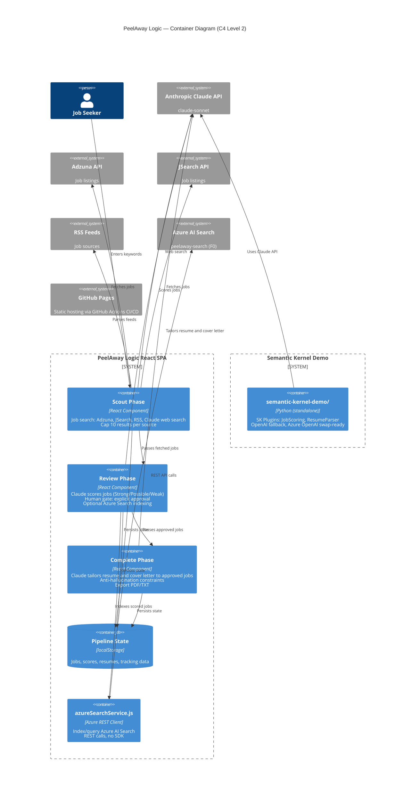
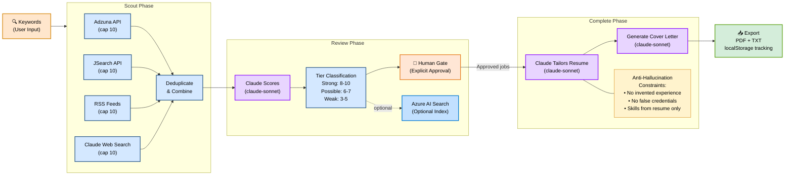
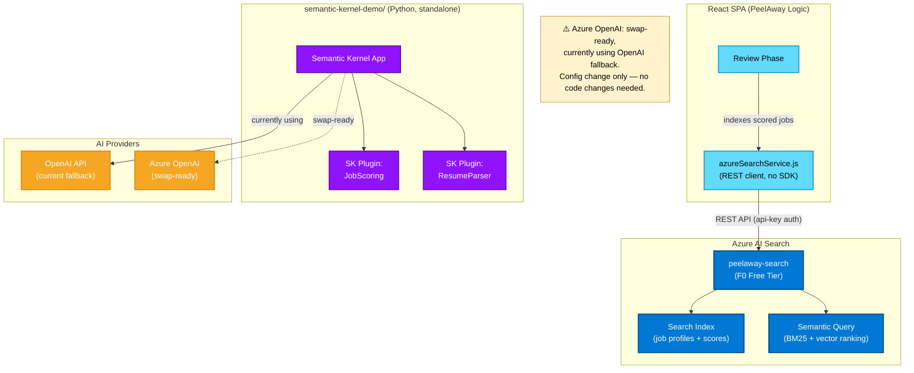
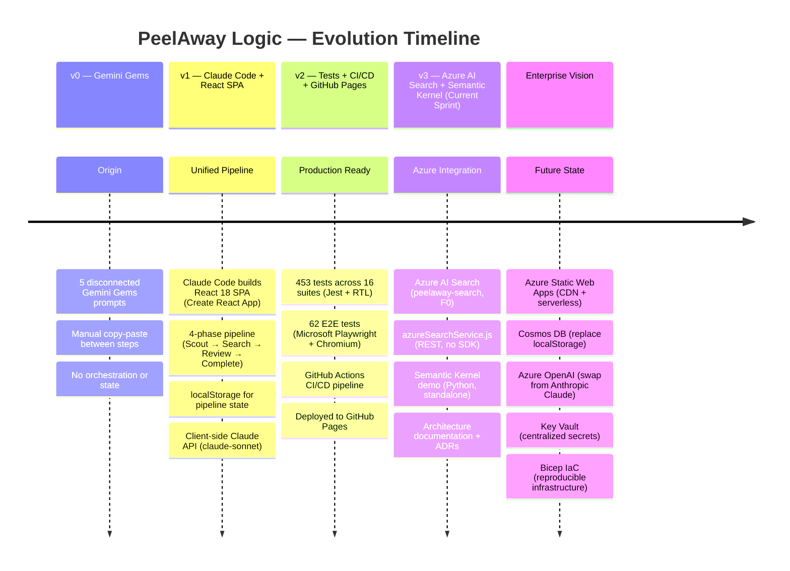

# PeelAway Logic: Architecture

## Overview

PeelAway Logic is an AI-powered job search pipeline built as a React 18 single-page application (Create React App), deployed to GitHub Pages. It orchestrates a 4-phase workflow (Scout, Search, Review, Complete) that transforms a resume and keywords into scored job matches and tailored application materials, using Anthropic Claude (claude-sonnet) for AI scoring and content generation with all state persisted in localStorage. The current sprint adds Azure AI Search integration and a standalone Semantic Kernel demo as enterprise proof-of-concept extensions.

## System Context

## Container Diagram

## Pipeline Data Flow

## Azure Integration

## Evolution Timeline

## Key Architectural Decisions

- [ADR-001: Claude over Azure OpenAI](decisions/ADR-001-claude-over-azure-openai.md): Why Anthropic Claude is the primary AI provider
- [ADR-002: REST over SDK](decisions/ADR-002-rest-over-sdk.md): Why Azure AI Search uses direct REST calls, not the Azure SDK
- [ADR-003: Human-Gated Pipeline](decisions/ADR-003-human-gated-pipeline.md): Why the Review phase requires explicit human approval
- [ADR-004: Project Evolution](decisions/ADR-004-project-evolution.md): How the system evolved from Gemini Gems to React SPA
- [ADR-005: GitHub Pages Hosting](decisions/ADR-005-github-pages-hosting.md): Why GitHub Pages over Azure Static Web Apps (for now)
- [ADR-006: Anti-Hallucination Constraints](decisions/ADR-006-anti-hallucination.md): How tailoring prevents fabricated experience
